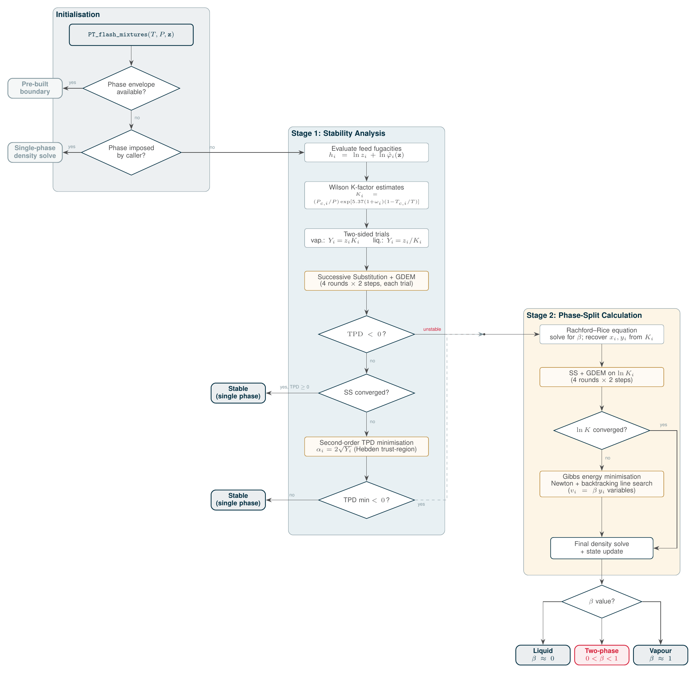

.. _mixtures:

********
Mixtures
********

.. contents:: :depth: 2

Theoretical description
-----------------------
The mixture modeling used in CoolProp is based on the work of Kunz et al. :cite:`Kunz-BOOK-2007,Kunz-JCED-2012` and Lemmon :cite:`Lemmon-JPCRD-2000,Lemmon-JPCRD-2004,Lemmon-IJT-1999`

A mixture is composed of a number of components, and for each pair of components, it is necessary to have information for the excess Helmholtz energy term as well as the reducing function.  See below for what binary pairs are included in CoolProp.

The numerical methods required for mixtures are far more complicated than those for pure fluids, so the number of flash routines that are currently available are relatively small compared to pure fluids.

The only types of inputs that are allowed for mixtures right now are

- Pressure/quality
- Temperature/quality
- Temperature/pressure

.. Used in Python script later on
.. role:: raw-html(raw)
   :format: html

Estimating binary interaction parameters
----------------------------------------

If you have a mixture that you would like to include in your analysis, but for which no interaction parameters are currently available, there are two estimation schemes available.  These estimation schemes should be used with extreme caution.  If you use these schemes, you should definitely check that you are getting reasonable output values.  In general, these estimation schemes should be used for fluids with similar properties.

The two schemes available are

* ``linear`` - :math:`T_r` and :math:`v_r` are a linear function of molar composition between the two pure fluid values
* ``Lorentz-Berthelot`` - all interaction parameters are 1.0

Here is a sample of using this in python:

.. ipython::

    In [1]: import CoolProp.CoolProp as CP

    # Create a simple linear mixing rule for the Helium and Xenon pair
    In [1]: CP.apply_simple_mixing_rule('Helium', 'Xenon', 'linear')

    # Now evaluate the 50/50 mixture density at 300K and atmospheric pressure
    In [1]: CP.PropsSI('Dmass','T',300,'P',101325,'Helium[0.5]&Xenon[0.5]')
    
.. warning::

    Use with caution!! For other mixtures this can give you entirely(!) wrong predictions
    

Using your own interaction parameters
-------------------------------------

If you have your own interaction parameters that you would like to use, you can set them using the ``set_mixture_binary_pair_data`` function.  (You can also retrieve them using the ``get_mixture_binary_pair_data`` function).  You must do this before you call any other functions that use them.  Also, you must set the boolean configuration variable ``OVERWRITE_BINARY_INTERACTION`` to ``true``.  This variable is ``false`` by default and will dis-allow overwrites of parameters that already exist.  Some sample code is below.

.. ipython::
    :okexcept:

    In [1]: import CoolProp.CoolProp as CP

    In [1]: CAS_He = CP.get_fluid_param_string('Helium','CAS')

    In [1]: CAS_Xe = CP.get_fluid_param_string('Xenon','CAS')

    @suppress
    In [1]: CP.set_config_bool(CP.OVERWRITE_BINARY_INTERACTION, True)

    # This adds a dummy entry in the library of interaction parameters if the mixture is not already there
    In [1]: CP.apply_simple_mixing_rule(CAS_He, CAS_Xe, 'linear')

    # If the binary interaction pair is already there, set the configuration flag 
    # to allow binary interaction parameters to be over-written
    In [1]: CP.set_config_bool(CP.OVERWRITE_BINARY_INTERACTION, True)
    
    # This is before setting the binary interaction parameters
    In [1]: CP.PropsSI('Dmass','T',300,'P',101325,'Helium[0.5]&Xenon[0.5]')

    In [1]: CP.set_mixture_binary_pair_data(CAS_He, CAS_Xe, 'betaT', 1.0)
    
    In [1]: CP.set_mixture_binary_pair_data(CAS_He, CAS_Xe, 'gammaT', 1.5)
    
    In [1]: CP.set_mixture_binary_pair_data(CAS_He, CAS_Xe, 'betaV', 1.0)
    
    In [1]: CP.set_mixture_binary_pair_data(CAS_He, CAS_Xe, 'gammaV', 1.5)

    # This is after setting the interaction parameters
    In [1]: CP.PropsSI('Dmass','T',300,'P',101325,'Helium[0.5]&Xenon[0.5]')
    
Once you have constructed an instance of an AbstractState using the low-level interface, you can set the interaction parameters *for only that instance* by calling the ``set_binary_interaction_double`` and ``get_binary_interaction_double`` functions.  This will have no effect on other instances, including the high-level calls, as shown below.

.. ipython::

    In [1]: import CoolProp.CoolProp as CP

    # This adds a dummy entry in the library of interaction parameters if the mixture is not already there
    In [1]: CP.apply_simple_mixing_rule(CAS_He, CAS_Xe, 'linear')
    
    # First use the high-level call to PropsSI to get the mass density of a 50/50 mixture:
    In [1]: CP.PropsSI('Dmass','T',300,'P',101325,'Helium[0.5]&Xenon[0.5]')
    
    # Now, use the low-level interface to modify the binary interaction parameters
    In [1]: AS = CP.AbstractState("HEOS","Helium&Xenon")
    
    In [1]: AS.set_binary_interaction_double(0, 1, 'betaT', 0.987)
    
    In [1]: AS.get_binary_interaction_double(0, 1, 'betaT')
    
    In [1]: AS.set_binary_interaction_double(0, 1, 'gammaT', 1.5)
    
    In [1]: AS.set_binary_interaction_double(0, 1, 'betaV', 1.0)
    
    In [1]: AS.set_binary_interaction_double(0, 1, 'gammaV', 1.5)

    In [1]: AS.set_mole_fractions([0.5,0.5])
    
    In [1]: AS.update(CP.PT_INPUTS, 101325, 300)
    
    In [1]: AS.rhomass()
    
    # Here you can see that this call to the high-level interface is untouched; 
    # giving the same ligh-level result from PropsSI() as above.
    In [1]: CP.PropsSI('Dmass','T',300,'P',101325,'Helium[0.5]&Xenon[0.5]')

And now, reset the OVERWRITE_BINARY_INTERACTION configuration variable to dis-allow overwrites.

.. ipython::

    In [1]: import CoolProp.CoolProp as CP

    In [1]: CP.set_config_bool(CP.OVERWRITE_BINARY_INTERACTION, False)

Phase Envelope
--------------

You can download the script that generated the following figure here: :download:`(link to script)<methane-ethane.py>`, right-click the link and then save as... or the equivalent in your browser.  You can also download this figure :download:`as a PDF<methane-ethane.pdf>`. 

.. image:: methane-ethane.png

.. _pt-flash:

Isothermal-Isobaric (PT) Flash
-------------------------------

Given a feed composition :math:`\mathbf{z}`, temperature :math:`T`, and pressure
:math:`P`, the PT flash determines whether the mixture is single-phase or splits
into vapour and liquid, and if so, computes the equilibrium phase compositions
and fractions.  CoolProp implements the classical two-stage Michelsen approach
:cite:`Michelsen-FPE-1982a,Michelsen-FPE-1982b,Michelsen-BOOK-2007` for both the
multi-parameter Helmholtz (HEOS) and cubic (SRK/PR) backends.

The algorithm selection is controlled by the configuration key
``MIXTURE_STABILITY_ALGORITHM``:

* ``1`` (default, from v8.0) -- Michelsen (1982) stability and phase-split
* ``0`` -- Legacy algorithm from Gernert et al. :cite:`Gernert-FPE-2014` (sole option in v7.x and earlier)

Overview
^^^^^^^^

The flash proceeds in two stages:

1. **Stability analysis** -- determine whether the feed is thermodynamically
   stable as a single phase, or whether a phase split will occur.
2. **Phase-split calculation** -- if the feed is unstable, compute the
   equilibrium compositions :math:`\mathbf{x}` (liquid), :math:`\mathbf{y}`
   (vapour), vapour fraction :math:`\beta`, and phase densities.

Both stages share the same equation-of-state evaluations (fugacity
coefficients and their composition derivatives) and density solvers.
The following sections describe the Michelsen algorithm as implemented.

.. _flash-logic-diagram:

Logic diagram
^^^^^^^^^^^^^

         Stage 1 (stability analysis) and Stage 2 (phase-split calculation).

   Overview of the blind PT flash algorithm.  Initialisation checks for
   pre-computed phase boundaries or caller-imposed phases before entering
   the Michelsen two-stage procedure.  Stage 1 evaluates the tangent plane
   distance (TPD) to detect instability; Stage 2 solves the phase split
   via successive substitution, GDEM acceleration and, if needed, a
   second-order Gibbs energy minimisation.

.. _tpd-stability:

Stage 1: Phase stability analysis
^^^^^^^^^^^^^^^^^^^^^^^^^^^^^^^^^^

The stability test determines whether a single-phase mixture at the given
:math:`(T, P, \mathbf{z})` is a true equilibrium state, or whether the Gibbs
energy can be lowered by splitting into two phases.  The method follows
Michelsen :cite:`Michelsen-FPE-1982a`.

**Tangent Plane Distance (TPD).**
A phase with composition :math:`\mathbf{z}` is stable if and only if the
tangent plane distance is non-negative for all trial compositions
:math:`\mathbf{Y}`:

.. math::

   \mathrm{TPD}(\mathbf{Y}) = \sum_i Y_i \bigl[\ln Y_i + \ln \hat{\varphi}_i(\mathbf{Y})
   - h_i\bigr] \geq 0

where :math:`h_i = \ln z_i + \ln \hat{\varphi}_i(\mathbf{z})` are the feed
chemical potentials.  A stationary point with :math:`\mathrm{TPD} < 0` proves
instability.

**Wilson K-factor initialisation.**
The initial K-factors for the two-sided test come from the Wilson correlation:

.. math::

   \ln K_i = \ln\!\left(\frac{P_{c,i}}{P}\right)
   + 5.373\,(1 + \omega_i)\!\left(1 - \frac{T_{c,i}}{T}\right)

Two trial compositions are formed:

* Vapour-like: :math:`Y_i = z_i \, K_i`
* Liquid-like: :math:`Y_i = z_i / K_i`

**Successive substitution with GDEM.**
For each trial, the stationarity condition
:math:`\ln Y_i + \ln \hat{\varphi}_i(\mathbf{Y}) = h_i` is iterated as:

.. math::

   \ln Y_i^{(k+1)} = h_i - \ln \hat{\varphi}_i\!\bigl(\mathbf{Y}^{(k)}\bigr)

Up to 4 rounds of 2 successive-substitution steps are performed.  After each
pair, the Generalised Dominant Eigenvalue Method (GDEM)
:cite:`CroweNishio-AIChE-1975`, as applied to flash calculations by
Michelsen and Mollerup :cite:`Michelsen-BOOK-2007`, accelerates convergence by
extrapolating along the dominant error direction:

.. math::

   \ln Y_i^{\,\text{extrap}} = \ln Y_i^{(k)}
   + \frac{r}{1 - r}\,e_i^{(k)}

where :math:`r = \sqrt{e^2_k / e^2_{k-1}}` (clamped to :math:`r < 0.95`) and
:math:`e_i` is the error vector from the latest step.

Early termination occurs if:

* :math:`\mathrm{TPD} < -10^{-7}` -- instability detected (fast path)
* :math:`\max_i |\Delta \ln Y_i| < 10^{-7}` -- converged to a stationary point
* Trial composition close to feed with positive curvature -- trivial solution

**Second-order TPD minimisation.**
If successive substitution is inconclusive, a trust-region quasi-Newton
minimisation of the TPD is performed in the transformed variables
:math:`\alpha_i = 2\sqrt{Y_i}` :cite:`Michelsen-FPE-1982a`.  This
transformation eliminates the non-negativity constraint on :math:`Y_i` and
improves the conditioning of the Hessian, which approaches the identity matrix
in the ideal-gas limit.

The gradient and Hessian in :math:`\alpha` variables are:

.. math::

   q_i &= \sqrt{Y_i}\bigl(\ln Y_i + \ln \hat{\varphi}_i - h_i\bigr) \\
   A_{ij} &= \delta_{ij}\bigl(1 + \tfrac{1}{2}s_i\bigr)
   + \tfrac{1}{4}\alpha_i \alpha_j \,
   \frac{\partial \ln \hat{\varphi}_i}{\partial n_j}

where :math:`s_i = \ln Y_i + \ln \hat{\varphi}_i - h_i`.
A Hebden-type restricted-step method :cite:`Hebden-1973` adjusts the
trust-region radius based on the ratio of actual to predicted objective
reduction.  The minimisation converges when the gradient norm falls below
:math:`10^{-7}`, with a maximum of 20 iterations.

.. _phase-split:

Stage 2: Phase-split calculation
^^^^^^^^^^^^^^^^^^^^^^^^^^^^^^^^^

When the stability test finds the feed to be unstable, the equilibrium phase
compositions and fractions are determined following
Michelsen :cite:`Michelsen-FPE-1982b`.

**Rachford-Rice equation.**
Given K-factors :math:`K_i = y_i / x_i` and feed :math:`\mathbf{z}`, the
vapour fraction :math:`\beta` is found from the Rachford-Rice equation
:cite:`RachfordRice-1952`:

.. math::

   \sum_{i=1}^{N_c} \frac{z_i\,(K_i - 1)}{1 + (K_i - 1)\,\beta} = 0

solved by Newton-Raphson with bisection safeguards.  The phase compositions
follow from:

.. math::

   x_i = \frac{z_i}{1 + (K_i - 1)\,\beta}, \qquad y_i = K_i \, x_i

**Successive substitution with GDEM.**
The K-factors are updated from the fugacity-coefficient ratio:

.. math::

   \ln K_i^{\,\text{new}} = \ln \hat{\varphi}_i^{(L)}(\mathbf{x})
   - \ln \hat{\varphi}_i^{(V)}(\mathbf{y})

As in the stability test, up to 4 rounds of 2 successive-substitution steps
with GDEM extrapolation :cite:`CroweNishio-AIChE-1975` are performed.
K-factors are stored in log space
(:math:`\ln K_i`) to avoid overflow for wide-boiling mixtures.  Convergence is
declared when :math:`\max_i |\Delta \ln K_i| < 10^{-7}`.

**Second-order Gibbs energy minimisation.**
If successive substitution has not converged to the required tolerance, a
Newton-Raphson minimisation of the Gibbs energy is employed.  The independent
variables are the vapour-phase mole numbers :math:`v_i = \beta\,y_i`, from
which the liquid mole numbers are :math:`l_i = z_i - v_i`.

The reduced gradient and Hessian (Michelsen :cite:`Michelsen-FPE-1982b`,
Appendix B) are:

.. math::

   g_i &= \beta(1-\beta)\bigl[\ln y_i + \ln \hat{\varphi}_i^{(V)}
   - \ln x_i - \ln \hat{\varphi}_i^{(L)}\bigr] \\
   H_{ij} &= \frac{\delta_{ij}\,\beta}{x_i}
   + \frac{\delta_{ij}(1-\beta)}{y_i}
   + \beta\,\frac{\partial \ln \hat{\varphi}_i^{(L)}}{\partial n_j}
   + (1-\beta)\,\frac{\partial \ln \hat{\varphi}_i^{(V)}}{\partial n_j} - 1

The Newton step :math:`\Delta\mathbf{v} = -\mathbf{H}^{-1}\mathbf{g}` is
accepted only if the Gibbs energy decreases; otherwise the step is halved
(backtracking line search).  Feasibility is maintained by scaling the step so
that all mole numbers remain positive.  Convergence requires
:math:`\max_i |g_i| < 10^{-9}`, with a maximum of 30 iterations.

.. _legacy-algorithm:

Legacy algorithm
^^^^^^^^^^^^^^^^

Setting ``MIXTURE_STABILITY_ALGORITHM`` to ``0`` selects the legacy algorithm
from Gernert et al. :cite:`Gernert-FPE-2014`, which was the sole option up to
and including CoolProp v7.x.  This algorithm uses successive substitution for
stability testing (up to 100 iterations, no GDEM or second-order TPD
minimisation) and a simultaneous Newton-Raphson solver on the iso-fugacity and
material-balance residuals for the phase split.  The Michelsen algorithm
(available from v8.0) is recommended for improved robustness, particularly near
critical points and for mixtures with components of very different volatility.

.. _flash-configuration:

Configuration
^^^^^^^^^^^^^

The stability algorithm is selected via:

.. code-block:: python

   import CoolProp.CoolProp as CP
   # Michelsen (default)
   CP.set_config_int(CP.MIXTURE_STABILITY_ALGORITHM, 1)
   # Legacy (Gernert et al.)
   CP.set_config_int(CP.MIXTURE_STABILITY_ALGORITHM, 0)

Reducing Parameters
-------------------

From Lemmon :cite:`Lemmon-JPCRD-2000` for the properties of Dry Air, and also from Lemmon :cite:`Lemmon-JPCRD-2004` for the properties of R404A, R410A, etc.

.. math::

    \rho_r(\bar x) = \left[ \sum_{i=1}^m\frac{x_i}{\rho_{c_i}}+\sum_{i=1}^{m-1}\sum_{j=i+1}^{m}x_ix_j\zeta_{ij}\right]^{-1}

.. math::

    T_r(\bar x) = \sum_{i=1}^mx_iT_{c_i}+\sum_{i=1}^{m-1}\sum_{j=i+1}^mx_ix_j\xi_{ij}

From the GERG 2008 formulation :cite:`Kunz-JCED-2012`

.. math::

    T_r(\bar x) = \sum_{i=1}^{N}x_i^2T_{c,i} + \sum_{i=1}^{N-1}\sum_{j=i+1}^{N}2x_ix_j\beta_{T,ij}\gamma_{T,ij}\frac{x_i+x_j}{\beta_{T,ij}^2x_i+x_j}(T_{c,i}T_{c,j})^{0.5}
    
.. math::

    \frac{1}{\rho_r(\bar x)}=v_r(\bar x) = \sum_{i=1}^{N}x_i^2\frac{1}{\rho_{c,i}} + \sum_{i=1}^{N-1}\sum_{j=i+1}^N2x_ix_j\beta_{v,ij}\gamma_{v,ij}\frac{x_i+x_j}{\beta^2_{v,ij}x_i+x_j}\frac{1}{8}\left(\frac{1}{\rho_{c,i}^{1/3}}+\frac{1}{\rho_{c,j}^{1/3}}\right)^{3}
    
Excess Helmholtz Energy Terms
-----------------------------
From Lemmon :cite:`Lemmon-JPCRD-2004` for the properties of R404A, R410A, etc.

.. math::

    \alpha^E(\delta,\tau,\mathbf{x}) = \sum_{i=1}^{m-1} \sum_{j=i+1}^{m} \left [ x_ix_jF_{ij} \sum_{k}N_k\delta^{d_k}\tau^{t_k}\exp(-\delta^{l_k})\right]
    
where the terms :math:`N_k,d_k,t_k,l_k` correspond to the pair given by the indices :math:`i,j`

From Lemmon :cite:`Lemmon-JPCRD-2000` for the properties of Dry Air

.. math::

    \alpha^E(\delta,\tau,\mathbf{x}) = \left \lbrace \sum_{i=1}^{2} \sum_{j=i+1}^{3} x_ix_jF_{ij}\right\rbrace \left[-0.00195245\delta^2\tau^{-1.4}+0.00871334\delta^2\tau^{1.5} \right]

From Kunz and Wagner :cite:`Kunz-JCED-2012` for GERG 2008 formulation

.. math::

    \alpha^E(\delta,\tau,\mathbf{x}) = \sum_{i=1}^{N-1} \sum_{j=i+1}^{N} x_ix_jF_{ij}\alpha_{ij}^r(\delta,\tau)
    
where

.. math::

    \alpha_{ij}^r(\delta,\tau) = \sum_{k=1}^{K_{pol,ij}}\eta_{ij,k}\delta^{d_{ij,k}}\tau^{t_{ij,k}}+\sum_{k=K_{pol,ij}+1}^{K_{pol,ij}+K_{Exp,ij}}\eta_{ij,k}\delta^{d_{ij,k}}\tau^{t_{ij,k}}\exp[-\eta_{ij,k}(\delta-\varepsilon_{ij,k})^2-\beta_{ij,k}(\delta-\gamma_{ij,k})]
    
and is for the particular binary pair given by the indices :math:`i,j`.  This term is similar in form to other Helmholtz energy terms for pure fluids though the derivatives are slightly special.

Appendix
--------
To convert from the form from Lemmon for HFC and Air to that of GERG 2008, the following steps are required:

.. math::

    x_0T_{c0}+(1-x_0)T_{c1}+x_0(1-x_0)\xi_{01} = x_0^2T_{c0}+(1-x_0)^2T_{c1} + 2x_0(1-x_0)\beta\gamma_T\frac{x_0+(1-x_0)}{\beta x_0 + (1-x_0)}\sqrt{T_{c0}T_{c1}}
    
set :math:`\beta=1`, solve for :math:`\gamma`.  Equate the terms

.. math::

    x_0T_{c0}+(1-x_0)T_{c1}+x_0(1-x_0)\xi_{01} = x_0^2T_{c0}+(1-x_0)^2T_{c1} + 2x_0(1-x_0)\gamma_T\sqrt{T_{c0}T_{c1}}
    
Move to LHS

.. math::

    [x_0-x_0^2]T_{c0}+[(1-x_0)-(1-x_0)^2]T_{c1}+x_0(1-x_0)\xi_{01} = 2x_0(1-x_0)\gamma_T\sqrt{T_{c0}T_{c1}}

Factor

.. math::

    x_0(1-x_0)T_{c0}+(1-x_0)[1-(1-x_0)]T_{c1}+x_0(1-x_0)\xi_{01} = 2x_0(1-x_0)\gamma_T\sqrt{T_{c0}T_{c1}}
    
Expand

.. math::

    x_0(1-x_0)T_{c0}+x_0(1-x_0)T_{c1}+x_0(1-x_0)\xi_{01} = 2x_0(1-x_0)\gamma_T\sqrt{T_{c0}T_{c1}}
    
Cancel factors of :math:`x_0(1-x_0)`

.. math::

    T_{c0}+T_{c1}+\xi_{01} = 2\gamma_T\sqrt{T_{c0}T_{c1}}
    
Answer:

.. math::

    \boxed{\gamma_T = \dfrac{T_{c0}+T_{c1}+\xi_{01}}{2\sqrt{T_{c0}T_{c1}}}}
    
Same idea for the volume

.. math::

    \boxed{\gamma_v = \dfrac{v_{c0}+v_{c1}+\zeta_{01}}{\frac{1}{4}\left(\frac{1}{\rho_{c,i}^{1/3}}+\frac{1}{\rho_{c,j}^{1/3}}\right)^{3}}}

Predefined mixtures
-------------------

.. include:: PredefinedMixturesCount.rst

CoolProp ships with |predefined_mixture_count| predefined mixtures that can be used directly by name using the ``.mix`` suffix.  For example::

    CoolProp.PropsSI('H','T',300,'P',101325,'Air.mix')

or via the low-level interface::

    AS = CoolProp.AbstractState('HEOS','Air.mix')

The table below lists all available predefined mixtures with their components and mole fractions.  The *Notes* column indicates mixtures that cannot currently be evaluated: either the mixture is not present in the compiled interaction-parameter library, or a required binary interaction parameter pair is missing.

.. csv-table:: Predefined mixtures included in CoolProp
   :header-rows: 1
   :file: PredefinedMixtures.csv

Binary pairs
------------

.. note::
   Please hover the mouse pointer over the coefficients to get the full accuracy
   for the listed coefficients. You can also get more information on references
   that are not in bibliography.

.. csv-table:: All binary pairs included in CoolProp
   :header-rows: 1
   :file: Mixtures.csv
