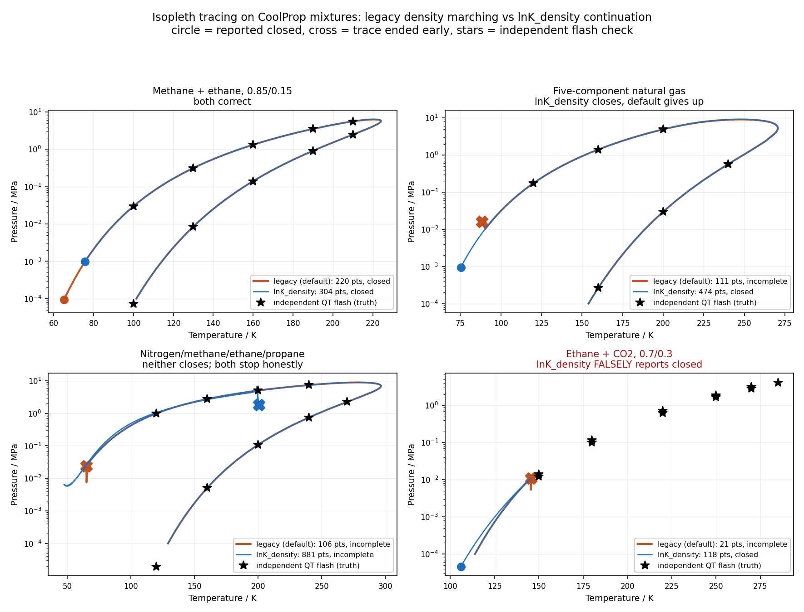

# Pluggable isopleth tracers for mixture phase envelopes

Date: 2026-09-11
Status: spike complete (section 8); superseded by the section 9 follow-up, in which small
fixes to the default tracer beat both candidates
Tracking: bd issues CoolProp-2ta4 (this work), CoolProp-jdph (legacy NaN defect found by the
corpus, fixed in section 9), CoolProp-gipl (candidate false closures)

## 1. Problem

`PhaseEnvelopeRoutines::build` traces the isopleth (constant overall
composition phase boundary) of a Helmholtz mixture by marching the feed-phase
molar density and solving Gernert's `(x, T, rho')` Newton system at each
step, with spline extrapolation in `rho''` for the guesses.  It is fast (10 to
40 ms for two to four components, 0.3 to 0.6 s for ten) but fails
structurally on ordinary mixtures.  Measured on 2026-09-11 with the current
code:

| Failure | Cause | Example |
|---|---|---|
| Returns silently with `built == false` | Only closure test is `p < p_start`; bubble branch hits the EOS low-T limit first, six corrector failures follow | N2/CH4/C2/C3, all ten natural gases in the predefined set |
| Wanders to 1500 to 8600 MPa | Trivial solution accepted (absolute 1e-3 mol/m3 test), no pressure bound | CH4/n-decane 70/30, CO2-rich quaternary, CH4/H2 |
| Degenerate start, NaN mole fractions | Dew point at 100 Pa is pure n-octane at 195 K, below its triple point; mole-fraction unknowns underflow | 15-component gas with heavy traces |
| Start fails outright | `solver_rho_Tp` cannot find the incipient density at 100 Pa | Amarillo, R508A |
| Stops after 30 points at 1.4 MPa | corrector failure storm near the critical point (singular Jacobian in these variables) | R504 |

Of 147 unique predefined mixtures, 31 cannot be constructed (missing binary
pairs, out of scope here), 106 trace a closed envelope, 10 do not.

## 2. Goal and non-goals

Goal: add continuation tracers from the literature behind a configuration
key, keep the current tracer as the default, and build a torture test over
all predefined mixtures so that any candidate can be compared against the
default on the same corpus before it is promoted.

Non-goals for this work:

- Changing the default algorithm.  Promotion is a separate decision backed
  by the torture table.
- Three-phase or liquid-liquid envelopes.  Tracers stop cleanly where a
  two-phase boundary ends; they do not detect a third phase.
- The isochoric parametric-marching tracer (Deiters and Bell 2019).  The
  driver below is written so that it can be added as another
  `IsoplethSystem` later; it is filed as follow-up work.
- Adding missing binary interaction pairs.

## 3. Literature basis

- Michelsen (1980), Fluid Phase Equilib. 4, 1: continuation in
  `(ln K_i, ln T, ln p)` with one specification equation, specified variable
  chosen as the largest tangent component, tangent predictor from the
  converged Jacobian, step size from the corrector iteration count, critical
  point crossed by the simultaneous sign change of all `ln K_i`.
- Nichita (2018), Fluid Phase Equilib., density-based phase envelope
  construction: the same continuation with phase densities as unknowns and
  pressure equality as an added equation, so no density root solve per
  iteration.  Natural for a Helmholtz EOS.
- Venkatarathnam (2014), Ind. Eng. Chem. Res. 53, 3723: density marching,
  which is what the legacy tracer does.
- Deiters and Bell (2019), AIChE J. 65, e16730: parametric marching in
  concentration space with an arclength parameter.  Deferred.
- yaeos (`phase_envelopes_pt.f90`): a maintained open-source implementation
  of the Michelsen scheme whose heuristics (near-critical `ln K` threshold of
  0.01, step caps in `ln K`, minimum step in `ln T` and `ln p`) are adopted
  below.

## 4. Design

### 4.1 Selection

A new string configuration key in `include/CoolProp/detail/configuration_keys.h`:

```
X(PHASE_ENVELOPE_ALGORITHM, "PHASE_ENVELOPE_ALGORITHM", "legacy",
  "Isopleth tracer for mixture phase envelopes: legacy, lnK_density, lnK_pressure")
```

`PhaseEnvelopeRoutines::build` keeps the pure-fluid branch unchanged.  For a
mixture it reads the key: `legacy` runs the existing code, moved verbatim
into a file-local `build_legacy`; any other recognised value calls
`PhaseEnvelopeTracers::trace(HEOS, algorithm, level)`; an unrecognised value
throws `ValueError` naming the valid options.  `finalize` runs unchanged for
every algorithm.  `refine` is only called by the legacy path; the new tracers
control point density directly (4.5).

### 4.2 Files

- `src/Backends/Helmholtz/PhaseEnvelopeTracers.h` and `.cpp` (new).  Holds
  the abstract `IsoplethSystem`, the two concrete systems, the
  `IsoplethContinuation` driver and the `trace` entry point.  Picked up by
  the existing `GLOB_RECURSE` over backend sources; only the two test files
  below need explicit `CMakeLists.txt` entries, like every other test file.
- `src/Backends/Helmholtz/PhaseEnvelopeRoutines.cpp`: dispatch only.
- `src/Tests/CoolProp-Tests-PhaseEnvelopeTracers.cpp` (new, fast tests).
- `src/Tests/CoolProp-Tests-PhaseEnvelopeTorture.cpp` (new, `[slow]`).

### 4.3 Storage convention (unchanged)

`PhaseEnvelopeData` stores the incipient phase as `*_liq` and `x`, and the
feed phase as `*_vap` and `y`, all the way around the envelope, exactly as
the legacy tracer does.  `store_variables` derives `Q` from the density
comparison and `K = y / x`.  The new tracers write through
`store_variables` and set the existing, currently unused, `icrit` field to
the index of the first stored point past the critical crossing (`-1` if no
crossing).  Downstream consumers (`is_inside`, `evaluate`, `finalize`, the
flash guidance in `FlashRoutines.cpp`, `TabularBackends.cpp`) need no
change.

### 4.4 `IsoplethSystem` interface

```
class IsoplethSystem {
public:
    virtual std::size_t size() const = 0;                 // number of unknowns
    virtual std::size_t index_lnT() const = 0;            // position of ln T in X
    virtual std::size_t index_marching() const = 0;       // ln p or ln rho_feed
    virtual bool is_lnK(std::size_t i) const = 0;         // i < N
    // Evaluate residuals and Jacobian at X for spec (ns, S); updates SatL/SatV.
    virtual void residual_jacobian(const Eigen::VectorXd& X, std::size_t ns, double S,
                                   Eigen::VectorXd& F, Eigen::MatrixXd& J) = 0;
    // Read back the physical state at the current X after a converged corrector.
    virtual void unpack(const Eigen::VectorXd& X, TracedPoint& pt) = 0;
    // Build X from a converged starting saturation state.
    virtual Eigen::VectorXd pack(const SaturationState& s0) const = 0;
};
```

`TracedPoint` carries `T, p, rho_inc, rho_feed, h_inc, h_feed, s_inc, s_feed,
x_inc`; the driver stores it with `store_variables(T, p, rho_inc, rho_feed,
h_inc, h_feed, s_inc, s_feed, x_inc, z)`.

Both systems share the composition mapping.  With `z` the feed composition
and `K_i` defined as feed over incipient mole fraction (the legacy `K = y/x`
convention), the unnormalised incipient amounts are `w_i = z_i / K_i` and
the incipient mole fractions are `x_i = w_i / W`, `W = sum_j w_j`.  Then

```
dx_k / dlnK_j = x_j (x_k - delta_kj)
```

so for any phase property `g` evaluated at normalised `x` with all mole
fractions treated as independent (`XN_INDEPENDENT`),

```
dg / dlnK_j = x_j ( sum_k x_k dg/dx_k  -  dg/dx_j ).
```

The scale redundancy of `K` (all `K_i` times a constant leaves `x`
unchanged) is removed by the equation `W - 1 = 0`, whose row has
`d/dlnK_j = -w_j`; its inner product with the null vector of ones is `-W`,
so the bordered Jacobian is nonsingular away from the critical point.

#### `LnKDensitySystem` (the recommended candidate)

Unknowns, `N + 3` of them:

```
X = [ lnK_1 .. lnK_N,  ln T,  ln rho_inc,  ln rho_feed ]
```

Equations:

```
F_i     = ln f_i(T, rho_inc, x) - ln f_i(T, rho_feed, z)      i = 1..N
F_{N+1} = W - 1
F_{N+2} = ( p(T, rho_inc, x) - p(T, rho_feed, z) ) / p_ref
F_{N+3} = X_ns - S
```

`p_ref` is the feed pressure at the last converged point, held constant
during a corrector so that the row stays exactly linear in the derivatives
below.  Both phases are updated with `DmolarT_INPUTS`, so no density root
solve occurs.  Jacobian entries, all from `MixtureDerivatives` with
`XN_INDEPENDENT`:

```
dF_i/dlnK_j        = x_j ( sum_k x_k D_ik - D_ij ),
                     D_ik = dln_fugacity_dxj__constT_rho_xi(inc, i, k)
dF_i/dlnT          = T ( dln_fugacity_i_dT__constrho_n(inc, i) - same(feed, i) )
dF_i/dln rho_inc   =  rho_inc  * dln_fugacity_i_drho__constT_n(inc, i)
dF_i/dln rho_feed  = -rho_feed * dln_fugacity_i_drho__constT_n(feed, i)
dF_{N+1}/dlnK_j    = -w_j
dF_{N+2}/dlnK_j    = x_j ( sum_k x_k P_k - P_j ) / p_ref,
                     P_k = dpdxj__constT_V_xi(inc, k)
dF_{N+2}/dlnT      = T ( dpdT__constV_n(inc) - dpdT__constV_n(feed) ) / p_ref
dF_{N+2}/dln rho_inc  =  rho_inc  * dpdrho__constT_n(inc)  / p_ref
dF_{N+2}/dln rho_feed = -rho_feed * dpdrho__constT_n(feed) / p_ref
dF_{N+3}/dX_ns     = 1
```

The marching variable for the initial specification is `ln rho_feed`, the
same quantity the legacy tracer marches.

#### `LnKPressureSystem` (the classic Michelsen form)

Unknowns, `N + 2`: `X = [lnK_1 .. lnK_N, ln T, ln p]`.  Each phase is
updated with `update_TP_guessrho` using its density from the previous
evaluation as the guess, as the legacy `P_IMPOSED` branch does.  Equations
`F_i` as above but at `(T, p)`, `F_{N+1} = W - 1`, `F_{N+2} = X_ns - S`.
Jacobian from `dln_fugacity_dxj__constT_p_xi`, `dln_fugacity_i_dT__constp_n`
and `dln_fugacity_i_dp__constT_n`, scaled by `T` and `p` for the log
variables.  Initial specification is `ln p`.

This variant exists to answer one question on the torture corpus: whether
the density root solve is a liability (cost, wrong root near the critical
point) or an asset (the `(T, p)` Jacobian is better scaled).  Both variants
share every line of the driver.

### 4.5 `IsoplethContinuation` driver

Options struct with defaults, all overridable in tests:

| Option | Default | Meaning |
|---|---|---|
| `dS_initial` | 0.05 | first step in log units of the marching variable |
| `dS_max_log` | 0.1 | cap on a step when the spec is `ln T`, `ln p` or `ln rho` |
| `dS_max_lnK` | 0.05 | cap when the spec is a `ln K` |
| `dS_max_lnK_critical` | 0.01 | cap when the spec is a `ln K` and `max_i |lnK_i| < lnK_critical` |
| `lnK_critical` | 0.01 | near-critical threshold |
| `dS_min` | 1e-6 | give up below this after repeated halving |
| `max_step_lnT`, `max_step_lnmarch` | 0.05 (level `""`), 0.02 (`veryfine`), 0.2 (`none`) | point-density caps on the predicted change of `ln T` and of the marching variable |
| `corrector_max_iter` | 10 | Newton iterations per point |
| `corrector_tol` | 1e-9 | on `max|F|` |
| `max_points` | 2000 | hard cap |
| `p_ceiling` | 1e9 Pa | stop for open envelopes |
| `min_points_for_built` | 5 | fewer than this throws |

Algorithm:

1. **Start.** Reuse the legacy start unchanged: `saturation_preconditioner`,
   `saturation_Wilson`, `successive_substitution` and one
   `newton_raphson_saturation` call with `P_IMPOSED` at
   `p_start = PHASE_ENVELOPE_STARTING_PRESSURE_PA`.  If any of these throws
   or yields a non-finite state, multiply `p_start` by 10 and retry, at most
   four times.  The `p_start` actually used is the closure pressure.  Pack
   the result into `X`, set `ns` to the marching index and `S = X_ns`, and
   choose the sign of `dS` so that the marching variable increases.
2. **Tangent.** Solve `J dXdS = e_ns` with the Jacobian of the last
   converged corrector (already factorised, so the tangent is free).  The
   `ns`-th row of `J` is the unit spec row, so `dXdS[ns] = 1`.
3. **Specification switch.** `ns_new = argmax_i |dXdS_i|`, restricted to
   the `ln K` entries while `max_i |lnK_i| < lnK_critical`.  If `ns_new` differs,
   rescale `dXdS` by `1 / dXdS[ns_new]` and `dS` by `dXdS[ns_new]` so the
   physical step is continuous across the switch.
4. **Step size.** `dS *= clamp(3 / iters_prev, 0.5, 2)`, then clamp `|dS|` to
   the cap that applies to `ns`, then shrink `dS` until the predicted
   changes `|dXdS[lnT] dS|` and `|dXdS[march] dS|` are within the
   point-density caps.
5. **Predictor.** `X_pred = X + dXdS dS`, `S_new = X_pred[ns]`.
6. **Corrector.** Newton on `F(X; ns, S_new)` from `X_pred` with the full
   Jacobian and `colPivHouseholderQr`, at most `corrector_max_iter`
   iterations, converged when `max|F| < corrector_tol`.  Any non-finite
   residual, Jacobian entry or step is a failure.
7. **Accept or reject (fail closed).**  Reject, halve `dS`, and go to 5 if:
   the corrector failed; `p_inc <= 0`; the corrector moved further than
   `2 |dS| max|dXdS|` from the predictor (converged onto another branch);
   or `ns` is not a `ln K` and `max_i |lnK_i| < 1e-8` (trivial solution).
   After halving below `dS_min`, stop the trace.
8. **Critical crossing.** If every `lnK_i` changed sign relative to the last
   stored point, set `env.icrit` to the index the new point will get.  No
   phase swap is needed: the equations are symmetric in the roles, and
   `store_variables` labels dew and bubble from the densities.
9. **Store** via `store_variables`, then check termination in this order:
   closed (`icrit >= 0`, `n > 5`, `p < p_start`, sets `closed = true`);
   `T < HEOS.Tmin()`; `p > p_ceiling`; `max_i x_i > 1 - 1e-9` (pure edge);
   `n >= max_points`.  Every stop except the first leaves `closed = false`.
10. **Finish.** If fewer than `min_points_for_built` points were stored,
    throw `ValueError` with the last corrector message; otherwise set
    `built = true`.  A partial envelope is never returned silently.

Debug output at `get_debug_level() > 0` prints one line per accepted point
(`n, ns, dS, iters, T, p, rho_inc, rho_feed, max|lnK|`) and one per
rejection with the reason.

### 4.6 Performance

The tangent is free because the converged Jacobian is reused.  Cost per
point is dominated by building the `N x N` block of `dln f_i / dx_k`
derivatives per corrector iteration, exactly as today; the win comes from
fewer corrector iterations per point (a first-order predictor along the
curve, typically two to three) and from fewer points (no `refine` pass).
The torture table records wall time per mixture per algorithm, which is the
evidence for or against a promotion.  Derivative caching inside
`MixtureDerivatives` is a separate optimisation and is not in scope.

## 5. Testing

### 5.1 Fast tests, `[phase_envelope][tracers]`

- Finite-difference check of both Jacobians on CH4/C2 0.85/0.15 and on
  N2/CH4/C2/C3 at a converged low-pressure point and at a point near the
  critical crossing: every entry within 1e-5 relative or 1e-9 absolute.
- CH4/C2 0.85/0.15 with `lnK_density` and with `lnK_pressure`: `built`,
  `closed`, `icrit >= 0`; dew temperature interpolated from the envelope at
  1, 3 and 5 MPa within 0.02 K of a blind `PQ_INPUTS` flash on a separate
  instance; the critical point estimated in the test by linear
  interpolation of the stored `lnK`, `T` and `p` between `icrit - 1` and
  `icrit` lies within 0.5 K and 1 % in pressure of `all_critical_points`
  (217.97 K, 6.2155 MPa).
- N2/CH4/C2/C3 0.10/0.34/0.41/0.15: `built`, `closed == false`, last point
  within 1 K above `Tmin()`, `max p < 20 MPa`, `icrit >= 0`.
- CH4/n-decane 0.7/0.3 and CO2/N2/O2/Ar 0.9/0.05/0.03/0.02: `built`,
  `max p < 100 MPa`, no point with `max_i |lnK_i| < 1e-8`.
- 15-component gas with heavy traces: `built`, every stored mole fraction
  finite and in `[0, 1]`.
- Start fallback: with `PHASE_ENVELOPE_STARTING_PRESSURE_PA = 100`, R508A
  and Amarillo build; the first stored pressure is greater than 100 Pa.
- Configuration: unknown algorithm name throws `ValueError`; `legacy`
  produces byte-identical `T`, `p` vectors to the current code on CH4/C2
  (guards the move into `build_legacy`).
- Existing tests keep passing untouched, since the default is `legacy`:
  `[michelsen][phase_envelope]` (#2637, #3243, #3192), the GERG envelope
  pin (`> 100` points), and `[mole_fractions][2308]`.

### 5.2 Torture test, `[phase_envelope][torture][slow]`

For every unique predefined mixture (deduplicated case-insensitively from
`get_global_param_string("predefined_mixtures")`) and every algorithm in
`{legacy, lnK_density, lnK_pressure}`:

- Construct the HEOS state; a construction failure is counted separately
  and skipped (missing binary pair).
- Build the envelope in a fresh instance; record `built`, `closed`, point
  count, wall time, `max p`, `T` range, `icrit`, and the exception text if
  any.
- Consistency check where possible: at three pressures spread between
  `p_start` and `0.8 p_max`, compare the dew temperature interpolated by
  `PhaseEnvelopeRoutines::evaluate` with a blind `PQ_INPUTS, Q = 1` flash on
  a separate instance; record the maximum relative deviation, or mark the
  check as unavailable when the blind flash fails.

Output: a summary table on stdout (one line per mixture per algorithm) and
a per-algorithm tally (`constructed / built / closed / consistent within
1e-3 / median time`).  When the environment variable
`COOLPROP_PHASE_ENVELOPE_TORTURE_CSV` names a path, the full table is also
written there for offline comparison.

Assertions: the `legacy` tally must not regress below the pinned baseline
(116 constructed, 106 closed).  The candidate algorithms are informational
until one is promoted, but each must finish every mixture without a crash
and within `max_points`, and any exception must be a `CoolProp::CoolPropError`
subclass (no raw `std::exception`, no non-finite stored values).

## 6. Risks and trade-offs

- `finalize` inserts cricondentherm and cricondenbar points using the legacy
  `RHOV_IMPOSED` Newton solver with cubic interpolation in the feed
  density.  That works on any point set where the feed density is locally
  monotone at the maxima, which holds for the new tracers too; failures are
  swallowed there today and stay swallowed.  A tangent-based maxima locator
  is a possible follow-up, not part of this work.
- `Tmin()` for a mixture is the mole-fraction-weighted component `Tmin`.
  It is a validity floor, not a freezing line; a bubble branch that
  physically ends in solid formation is still traced to this floor.
- The `p_ref` scaling of the pressure row makes `F_{N+2}` dimensionless but
  not scale-free across the trace; the corrector tolerance therefore
  applies to a pressure mismatch of about `1e-9 p_ref`, which is far below
  any consumer's needs.
- The `XN_INDEPENDENT` derivative path in `MixtureDerivatives` is less
  exercised than `XN_DEPENDENT`; the finite-difference Jacobian test in 5.1
  is the guard.
- The torture test triples the envelope work for 116 mixtures.  Measured
  legacy total is 4.6 s; the candidates are expected to be comparable, so
  the tagged `[slow]` cost is well under a minute.

## 7. Follow-ups filed, not done here

- Isochoric parametric-marching `IsoplethSystem` (Deiters and Bell 2019).
- Promotion decision for a candidate once the torture table supports it,
  including the documentation change for the configuration key.
- Derivative caching in `MixtureDerivatives` for the `N x N` block.
- The 31 predefined mixtures with missing binary pairs.

## 8. Spike results (measured 2026-09-11)

Both candidates were implemented behind `PHASE_ENVELOPE_ALGORITHM` with the
legacy tracer left as the default, and run against the torture corpus: 147
unique predefined mixtures plus 42 hard cases (azeotropes, open envelopes,
wide-boiling pairs, near-pure limits, a 15-component gas with heavy traces).
157 of the 189 construct; the other 32 lack binary interaction parameters.

| | legacy | lnK_density | lnK_pressure |
|---|---|---|---|
| built | 133 | **155** | 155 |
| closed | 130 | 131 | 1 |
| **closed and verified correct** | **123** | 116 | 0 |
| false closures | 7 | 15 | 1 |
| median points | 207 | **177** | 128 |
| median time | 8.8 ms | **7.5 ms** | 10.1 ms |
| 90th-percentile time | 40 ms | 41 ms | 41 ms |
| total | **4.2 s** | 22.4 s | 12.2 s |



### The verdict: no candidate is proven better, so the default does not move

`lnK_density` is the better *tracer* on reach and the worse one on
*trustworthiness*, and reach is not what earns a promotion.

What it wins: it builds 155 envelopes against the default's 133, so 22
mixtures that the default abandons now produce something usable. It handles
every natural gas in the predefined set, a five-component gas and the
nitrogen/methane/ethane/propane quaternary, all of which the default gives up
on; it starts R508A, whose 100 Pa dew point the default cannot solve at all;
and its median case is slightly faster with fewer points.

What it loses, and why that decides it: 15 of its 131 closures are wrong,
against 7 of the default's 130, so it ends with 116 verified-correct
envelopes against 123. **Turning a visible failure into a silently wrong
answer is a regression even when the closed count goes up.** Until that is
fixed, `legacy` stays the default and this is not a close call.

The worst case is ethane + carbon dioxide at 0.7/0.3, whose real envelope
reaches 4.2 MPa at 285 K (confirmed by direct `QT` flashes). The default
traces 21 points to 11 kPa and reports failure. `lnK_density` traces 118
points over the same 11 kPa fragment and reports it *closed*, 47 % off. The
natural gas samples close 5.9 % off. Two more (R472A, R472B) are shared with
the default at identical deviations, which points at the blind flash rather
than at either tracer.

### How closure is verified, and why the first measurement was wrong

Closure alone is meaningless as a quality metric: a trace that collapses onto
a degenerate root also drives the pressure down and then reports success. The
corpus therefore cross-checks each stored point against a blind `QT` flash on
a separate instance and counts a closure with more than 0.1 % pressure
deviation as a *false closure*. Both counts are printed, listed case by case,
and pinned.

Two earlier versions of this check gave the wrong answer and are worth
recording:

1. **Checking only the dew branch** made `lnK_density` look like the winner
   (130 correct against 126). Every false closure found since is on the
   bubble branch, which the dew-only check never looked at.
2. **Splitting the branches at the critical index** then made the default
   look catastrophic (88 false closures). The default never sets that index,
   so half its points were compared against the wrong branch. The stored `Q`
   flag, which `store_variables` derives from the density ordering, is the
   correct branch label for every algorithm and needs no assumption about
   point ordering.

The deviation distribution is strongly bimodal: the median closed envelope
agrees with the blind flash to 1e-8 and the failures are percent-level, so
the verdict is insensitive to the threshold anywhere between 1e-4 and 1e-2.

**`lnK_pressure` loses outright and should not be promoted.** It builds 155
envelopes and closes none correctly: 154 of 157 traces end as `stalled`,
because `update_TP_guessrho` cannot find the incipient density root once the
two phases approach each other near the critical point. It is kept as a
selectable option because it shares the whole driver and costs nothing, and
because the negative result answers the question section 4.4 posed: for a
Helmholtz EOS the density root solve is a liability, not an asset.

### What the driver needed beyond the design

Four things were not in the design and turned out to be load-bearing:

1. **A direction-of-travel guard.** A predictor that overshoots a turning
   point lets the corrector land back on the stretch already traced, and the
   trace then retraces itself for hundreds of points. Rejecting a step whose
   corrected displacement opposes the previous tangent fixed it.
2. **A step cap that scales with `max|ln K|`.** In a low-temperature tail the
   incipient phase goes numerically pure and `ln K` races to tens while T and
   the marching density barely move; a fixed cap spent 800 points there.
3. **A degeneracy stop relative to the starting spread.** An absolute
   `max|ln K|` limit rejects the first point of a wide-boiling gas, which can
   start at 61. The limit is `max(50, 1.2x the value at the start)`.
4. **No temperature floor.** `HEOS.Tmin()` is a mole-fraction-weighted number
   that real envelopes run well below: methane/ethane traces to 65 K against a
   weighted floor of 91 K. Using it as a floor truncated 50 envelopes that
   otherwise close. Traces that run out of EOS now stop as `stalled`, which is
   reported rather than silent.

The pressure-equality residual also needed scaling by `max(p_ref, 1e-3 rho R T)`
rather than `p_ref` alone: the liquid pressure is a difference of terms of
order `rho R T`, so its round-off noise is a fixed fraction of that, and a
100 Pa dew point cannot be asked for pressure equality to 1e-9 of 100 Pa.

### Defects found in existing code

- **The legacy tracer stores NaN mole fractions** for the 15-component gas
  (bd CoolProp-jdph), and returns `built = false` with no error. Pinned in the
  corpus so the count cannot grow.
- **`finalize` could read out of bounds and throw.** Its 4-point spline
  stencil indexes `imax - 1` without checking that the extremum has room on
  both sides, so an extremum at index 0 underflowed `std::size_t`. Its
  `spline.build()` also sat outside the try/catch that already swallows
  maxima-insertion failures, so a singular spline propagated out and failed an
  otherwise good envelope. Both are fixed, which hardens the legacy path too.

### Remaining work before `lnK_density` could become the default

1. **The 15 false closures, which are the blocker.**  Ethane + carbon dioxide
   at 0.7/0.3 must either reach the real 4.2 MPa boundary or refuse to call an
   11 kPa fragment closed.  A closure test that also required the envelope to
   span a plausible pressure range, or that restarted from the opposite end
   and met in the middle, would catch this class.
2. The refrigerant blends the default closes and this one does not.
3. The cases that end at the 1 GPa ceiling or the point cap: confirm which are
   genuine open branches and which are the trace wandering.
4. A promotion decision needs the flash paths exercised against envelopes
   built by the new tracer, not just the envelope geometry.
5. The isochoric parametric-marching system (Deiters and Bell 2019) is still
   unimplemented; the `IsoplethSystem` interface is shaped to take it.

## 9. Follow-up (2026-09-12): small tweaks to the default tracer beat both candidates

The spike's conclusion was that no continuation candidate had earned promotion.  The obvious
next question was whether the default's failures needed a new algorithm at all.  They did not:
most were bookkeeping, and three small changes plus two latent-bug fixes take the default past
every candidate on every correctness metric.

| | legacy before | **legacy after** | lnK_density |
|---|---|---|---|
| built | 133 | **155** | 155 |
| closed | 130 | **131** | 131 |
| **closed and verified correct** | 123 | **126** | 116 |
| false closures | 7 | **5** | 15 |
| envelopes storing a non-finite value | 1 | **0** | 0 |
| predefined mixtures closed | 106 | **107** | 105 |
| median time | 8.8 ms | 8.8 ms | 7.6 ms |
| total | 4.2 s | 6.0 s | 22.8 s |

### The three tweaks

1. **Retry the start pressure by decades.**  The configured 100 Pa start is unsolvable for some
   blends, whose incipient liquid there sits below its own triple point, and the whole build
   failed with no envelope.  Amarillo and R508A went from nothing to a usable envelope, and
   R508A closes.
2. **Stop returning silently.**  The `failure_count > 5` path returned with `built` still false
   and no exception; 24 of 157 corpus mixtures ended there, handing callers an empty envelope
   and no way to know.  It now keeps a partial envelope when at least 20 points were traced,
   marks it open rather than closed, and records why; below that it throws.  Both envelope-guided
   flash paths gate on `built` alone but wrap the guided solve in try/catch with a blind
   fallback, so a partial envelope is safe for them.
3. **Report a stop reason**, shared with the new tracers via
   `PhaseEnvelopeTracers::set_last_stop`, so a caller can tell a closed envelope from an
   abandoned one.

### Two latent bugs the tweaks exposed, both pre-existing

Refining partial envelopes reached code paths that closed envelopes never do.

- **`refine` could not terminate.**  Its density sweep was
  `for (rho = start*factor; rho < end; rho *= factor)` with `factor = pow(end/start, 1/N)`.
  When two adjacent points have nearly equal vapor density the factor rounds to exactly 1, every
  swept density lands back on the segment start, and refine inserts an unbounded run of
  duplicates of that one point.  The array then grows exactly as fast as the index advances, so
  the outer loop never reaches the end either.  Ekofisk emitted 99882 identical points.  A closed
  envelope escapes through the coarseness skip at the top of the loop, which is why this never
  fired before.  The sweep is now an integer loop over `k = 1..N-1` (exactly the same densities),
  segments narrower than a rounding step are skipped, the index is guaranteed to advance every
  pass, and total insertions are capped.
- **Only the state variables were checked before storing a point.**  For a wide-boiling
  multicomponent gas the trace-component mole fractions underflow and go non-finite while T, p
  and the densities still look reasonable, so the bad composition was stored and handed to
  callers.  All three insert sites now share one `require_storable` check covering composition
  and caloric properties as well.  This closes the NaN defect (bd CoolProp-jdph) at its root
  rather than pinning it.

### What this means for the candidates

`lnK_density` no longer wins on anything except median speed, where the margin is 1.2 ms on a
sub-10 ms operation.  The default now matches it on reach (155 built, 131 closed) and beats it
decisively on correctness (126 verified against 116, 5 false closures against 15) at a quarter
of the total time.  The candidates stay available behind the configuration key as a research
tool and as the record of a measured negative result, but there is no longer a case for
promoting either, and the remaining work in section 8 is lower priority than it looked.

The broader lesson is that the default tracer's marching scheme was never the problem.  Its
failures were an unsolvable fixed start pressure, a silent early return, and two unreachable-
until-now bugs in the refinement pass.
