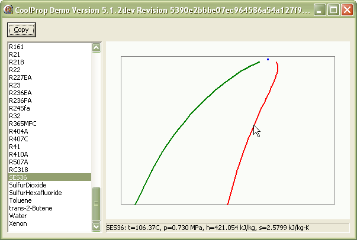
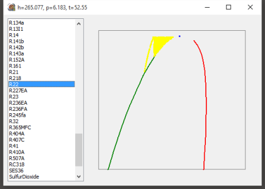

CoolProp Delphi Wrapper Demo.
=============================

Bruce Wernick, info@coolit.co.za

13 December 2015

project4 is a demo based on the win32 shared DLL downloaded from the CoolProp 
site.

There are two parts:
  1. The actual DLL interface.
  2. A simple ph-chart builder.

The original CoolProp code is written in C++.  In the CoolProp source folder, 
you can find the text file exports.txt that details the complete list of functions 
exported by the CoolProp DLL.  
I have only implemented the essential ones but it would be 
easy to add any I have omitted.  My interface mimics the C header file 
but there are a few considerations.  The returning string is an array of char.  
In Delphi, you could use an array of AnsiChar parameter.  Instead, I chose to use 
the PAnsiChar because it makes the dll interface clearer and more universal.  
One thing you have to be aware of - the calling program has to allocate memory 
for the result.  If this is not sized sufficiently, then a blank string is 
returned.  This could happen, for example, if a lot of fluids are added to 
the file.

The graphical part draws the saturation curve on conventional log(p) vs enthalpy 
axes.  The program main form has a Delphi VCL TListView and a TPaintBox.  
On startup, the program uses the DLL to populate the ListView with all of 
the available fluids.  The PaintBox is a very basic components that is really 
just a canvas.  The main program creates a TMolChart class that does all the 
work on a canvas.  When the OnPaint fires in the main form, the chart is re-drawn.

See the project4 output here

The chart is auto scaled around the critical point and atmospheric pressure 
(where possible).  This makes it quite convenient for comparing the shape of 
the various saturation curves.  What it needs is some isotherms and some 
isentropic lines.  If anyone has the urge to add these I would like to get 
an update.

Just to highlight some of the other features, I have added a few simpler command line
versions.

Lazarus users
-------------
With some minor changes, you could quite easily run this code with Lazarus.

Floating Point Exceptions
-------------------------
A note about some specific problems that I found with Delphi.  
Apparently, most compiers automatically disable floating point exceptions.  The 
Delphi compiler does not do this.  Actually, this does not fix the problem, it
simply hides it.  

You can see the errors on this image

